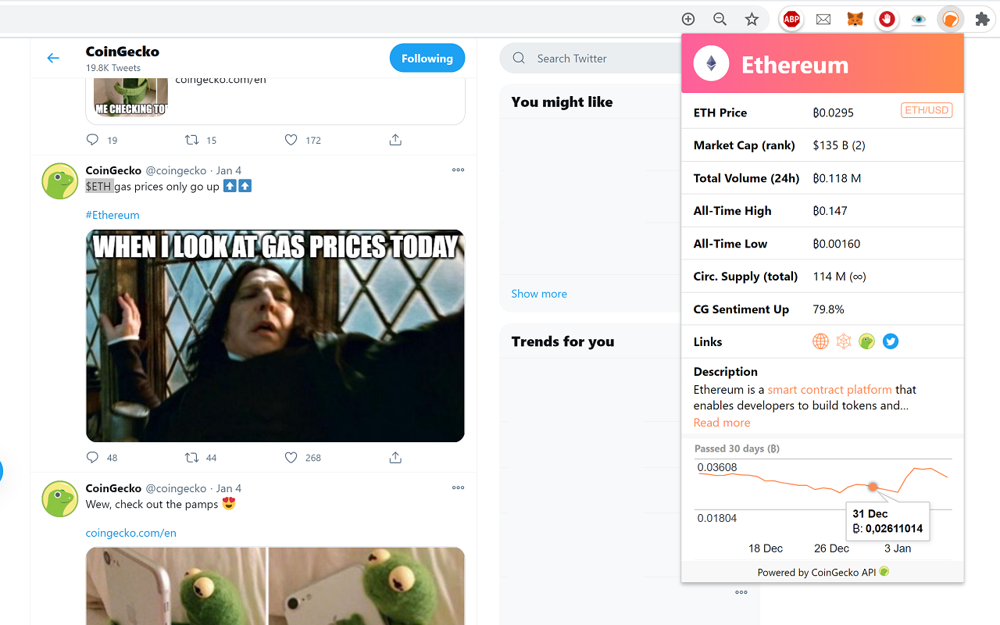

# Cryptocurrency Chrome extension
A Google Chrome extension which displays information about a cryptocurrency in a popup when the user selects a coin ticker (BTC/ ETH/ XYZ) and presses CTRL+SHIFT+K.

## Previews
### Ethereum/ US Dollar pop-up on Twitter

 
  

### Ethereum/ Bitcoin pop-up on Twitter

 
  

### VeChain/ US Dollar pop-up on Whatsapp

 
  

